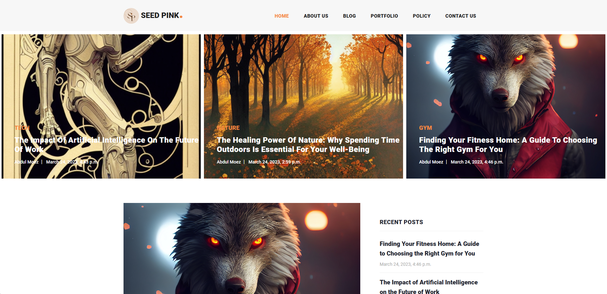

# Seed Pink - Blog Website


[](https://github.com/Anonym0usWork1221/Seed-Pink/stargazers)
[](https://github.com/Anonym0usWork1221/Seed-Pink/network/members)
[](https://github.com/Anonym0usWork1221/Seed-Pink/issues)
[](https://github.com/Anonym0usWork1221/Seed-Pink/watchers)
[](https://www.python.org)

 *  Date   : 2024/09/28
 *  Author : **__Abdul Moez__**

 **MIT License**

## Introduction
Seed Pink is a blog-focused webpage with content related to multiple niches. The site includes sections like Home, About Us, Blog, Portfolio, Policy, and Contact Us. This guide will help you install, migrate, and run the Seed Pink project using Django.

## Requirements

- **Python**: 3.11 or greater
- **Django**: Make sure you have Django installed. If not, the `requirements.txt` file will handle it.

## Installation

1. Clone the repository:
   ```bash
   git clone https://github.com/Anonym0usWork1221/Seed-Pink.git
   cd seedpink
   ```

2. Install the dependencies:
   ```bash
   pip install -r requirements.txt
   ```

   This will install all necessary packages, including Django.

## Database Setup and Migrations

Once the dependencies are installed, you need to set up the database and migrate the models.

1. Run the following commands to apply migrations:
   ```bash
   python manage.py makemigrations
   python manage.py migrate
   ```

   This will create all necessary tables in your database.

## Running the Server

To start the Django development server, run:

```bash
python manage.py runserver 127.0.0.1:8008
```

The application will be accessible at `http://127.0.0.1:8008/`.

## Home Page
<p align="center">
  
</p>

## Admin Access

To access the Django admin panel, create a superuser:

```bash
python manage.py createsuperuser
```

Then, you can log in to the admin panel at `http://127.0.0.1:8008/admin/` and manage blog posts, categories, and other content.

---

### Sections of the Website:

- **Home**: Overview of Seed Pink.
- **About Us**: Information about Seed Pink.
- **Blog**: A collection of blog posts categorized by fitness, tech, and nature.
- **Portfolio**: Displays projects or work-related content.
- **Policy**: Details regarding privacy and policies.
- **Contact Us**: A form to reach out to the Seed Pink team.

For any issues or contributions, feel free to submit a pull request or open an issue in the repository.

---

# Contributors

<a href = "https://github.com/Anonym0usWork1221/Seed-Pink/graphs/contributors">
  
</a>


Buy Me a coffee
--------------
__If you'd like to show your support and appreciation for my work, you can buy me a coffee using the 
following payment option:__

**Payoneer**: `abdulmoez123456789@gmail.com`

> Your support is greatly appreciated and helps me continue providing valuable assistance and resources. 
Thank you for your consideration.
> 